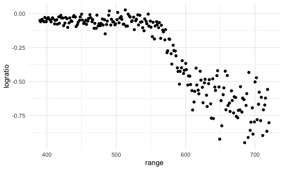
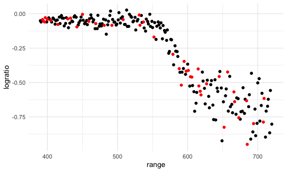
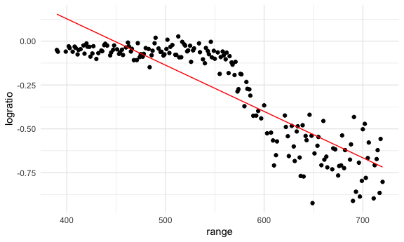
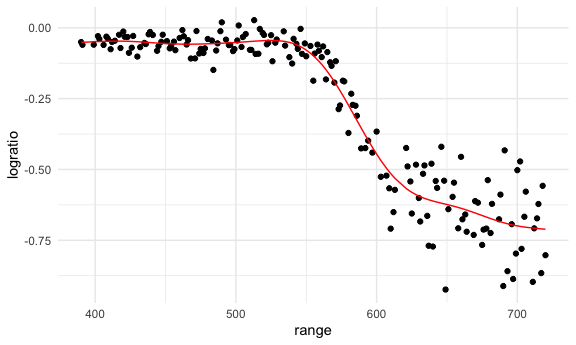
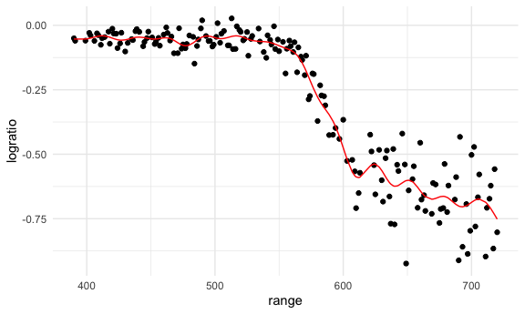
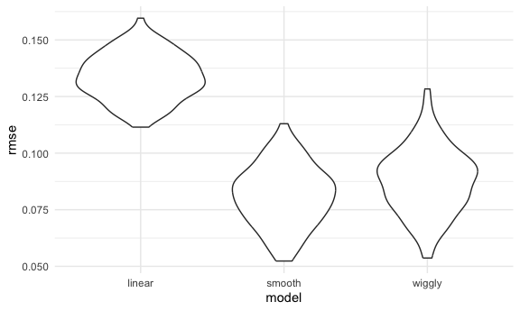
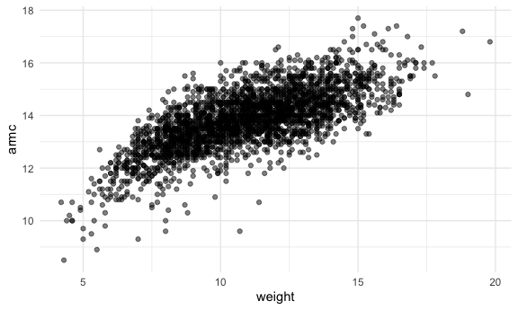
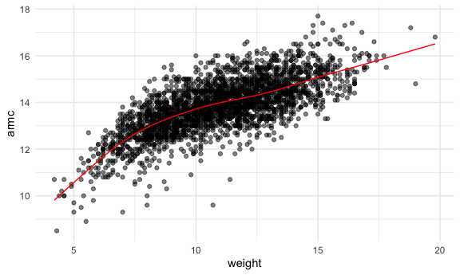
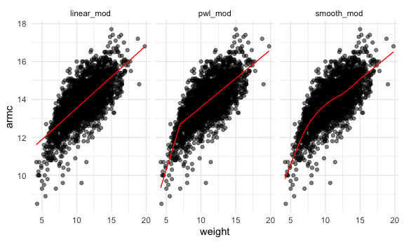
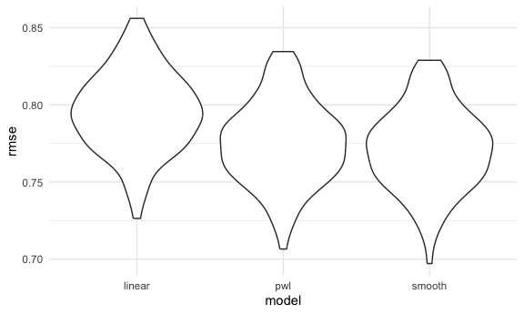

Cross Validation
================

Load key packages.

``` r
library(tidyverse)
library(modelr)
library(mgcv)
```

    ## Loading required package: nlme

    ## 
    ## Attaching package: 'nlme'

    ## The following object is masked from 'package:dplyr':
    ## 
    ##     collapse

    ## This is mgcv 1.9-1. For overview type 'help("mgcv-package")'.

``` r
# install.packages("SemiPar")
library(SemiPar)

set.seed(1)
```

look at LIDAR data

``` r
data("lidar")

lidar_df =
  lidar |> 
  as_tibble() |> 
  mutate(id = row_number())
```

``` r
lidar_df |> 
  ggplot(aes(x = range, y = logratio)) + 
  geom_point()
```



## Try to do CV

We’ll compare 3 models – one linear, one smooth, one wiggly.

Construct training and testing df

``` r
train_df = sample_frac(lidar_df, size = .8)
test_df = anti_join(lidar_df, train_df, by = "id")
```

Look at these

``` r
ggplot(train_df, aes(x = range, y = logratio)) + 
  geom_point() + 
  geom_point(data = test_df, color = "red")
```



Fit three models

``` r
linear_mod = lm(logratio ~ range, data = train_df)
smooth_mod = gam(logratio ~ s(range), data = train_df)
wiggly_mod = gam(logratio ~ s(range, k = 30), sp = 10e-6, data = train_df)
```

Look at fits

``` r
train_df |> 
  add_predictions(linear_mod) |> 
  ggplot(aes(x = range, y = logratio)) + 
  geom_point() + 
  # geom_point(data = test_df, color = "red") + 
  geom_line(aes(y = pred), color = "red")
```



``` r
train_df |> 
  add_predictions(smooth_mod) |> 
  ggplot(aes(x = range, y = logratio)) + 
  geom_point() + 
  # geom_point(data = test_df, color = "red") + 
  geom_line(aes(y = pred), color = "red")
```



``` r
train_df |> 
  add_predictions(wiggly_mod) |> 
  ggplot(aes(x = range, y = logratio)) + 
  geom_point() + 
  # geom_point(data = test_df, color = "red") + 
  geom_line(aes(y = pred), color = "red")
```



``` r
train_df |> 
  gather_predictions(linear_mod, smooth_mod, wiggly_mod) |> 
  ggplot(aes(x = range, y = logratio)) + 
  geom_point() + 
  # geom_point(data = test_df, color = "red") + 
  geom_line(aes(y = pred), color = "red") +
  facet_grid(. ~model)
```


Compare these numerically using RMSE.

``` r
rmse(linear_mod, test_df)
```

    ## [1] 0.127317

``` r
rmse(smooth_mod, test_df)
```

    ## [1] 0.08302008

``` r
rmse(wiggly_mod, test_df)
```

    ## [1] 0.08848557

## Using `modelr`

## Repeat the train / test split

``` r
cv_df = 
  crossv_mc(lidar_df, 100) 
cv_df |> pull(train) |> nth(1) |> as_tibble()
```

    ## # A tibble: 176 × 3
    ##    range logratio    id
    ##    <int>    <dbl> <int>
    ##  1   390  -0.0504     1
    ##  2   394  -0.0510     4
    ##  3   396  -0.0599     5
    ##  4   399  -0.0596     7
    ##  5   400  -0.0399     8
    ##  6   402  -0.0294     9
    ##  7   403  -0.0395    10
    ##  8   405  -0.0476    11
    ##  9   406  -0.0604    12
    ## 10   408  -0.0312    13
    ## # ℹ 166 more rows

``` r
cv_df |> pull(test) |> nth(1) |> as_tibble()
```

    ## # A tibble: 45 × 3
    ##    range logratio    id
    ##    <int>    <dbl> <int>
    ##  1   391  -0.0601     2
    ##  2   393  -0.0419     3
    ##  3   397  -0.0284     6
    ##  4   412  -0.0500    16
    ##  5   421  -0.0316    22
    ##  6   424  -0.0884    24
    ##  7   426  -0.0702    25
    ##  8   427  -0.0288    26
    ##  9   436  -0.0573    32
    ## 10   445  -0.0647    38
    ## # ℹ 35 more rows

``` r
cv_df = 
  crossv_mc(lidar_df, 100) |> 
  mutate(
    train = map(train, as_tibble),
    test = map(test, as_tibble)
  )
```

``` r
cv_df |> 
  pull(train) |> 
  nth(3) |> 
  as_tibble()
```

Fit models, extract RMSEs

``` r
cv_res_df =
  cv_df |> 
  mutate(
    linear_mod = map(train, \(x) lm(logratio ~ range, data = x)),
    smooth_mod = map(train, \(x) gam(logratio ~ s(range), data = x)),
    wiggly_mod = map(train, \(x) gam(logratio ~ s(range, k = 30), sp = 10e-6, data = x))
  ) |> 
  mutate(
    rmse_linear = map2_dbl(linear_mod, test, rmse),
    rmse_smooth = map2_dbl(smooth_mod, test, rmse),
    rmse_wiggly = map2_dbl(wiggly_mod, test, rmse)
  )
```

Look at RMSE distribution

``` r
cv_res_df |> 
  select(starts_with("rmse")) |> 
  pivot_longer(
    everything(),
    names_to = "model", 
    values_to = "rmse",
    names_prefix = "rmse_"
  ) |> 
  ggplot(aes(x = model, y = rmse)) + 
  geom_violin()
```



``` r
cv_res_df |> 
  select(starts_with("rmse")) |> 
  pivot_longer(
    everything(),
    names_to = "model", 
    values_to = "rmse",
    names_prefix = "rmse_"
  ) |> 
  group_by(model) |> 
  summarize(avg_rmse = mean(rmse))
```

    ## # A tibble: 3 × 2
    ##   model  avg_rmse
    ##   <chr>     <dbl>
    ## 1 linear   0.134 
    ## 2 smooth   0.0812
    ## 3 wiggly   0.0878

## Nepalese children Df

``` r
child_df = 
  read_csv("nepalese_children.csv") |> 
  mutate(
    weight_ch7 = (weight > 7) * (weight - 7)
  )
```

    ## Rows: 2705 Columns: 5
    ## ── Column specification ────────────────────────────────────────────────────────
    ## Delimiter: ","
    ## dbl (5): age, sex, weight, height, armc
    ## 
    ## ℹ Use `spec()` to retrieve the full column specification for this data.
    ## ℹ Specify the column types or set `show_col_types = FALSE` to quiet this message.

Look at data

``` r
child_df |> 
  ggplot(aes(x = weight, y = armc)) + 
  geom_point(alpha = .5)
```



Fit some models

``` r
linear_mod = lm(armc ~ weight, data = child_df)
pwl_mod    = lm(armc ~ weight + weight_ch7, data = child_df)
smooth_mod = gam(armc ~ s(weight), data = child_df)
```

Look at models

``` r
child_df |> 
  add_predictions(smooth_mod) |> 
  ggplot(aes(x = weight, y = armc)) + 
  geom_point(alpha = .5) + 
  geom_line(aes(y = pred), color = "red")
```



``` r
child_df |> 
  gather_predictions(linear_mod, pwl_mod, smooth_mod) |> 
  ggplot(aes(x = weight, y = armc)) + 
  geom_point(alpha = .5) + 
  geom_line(aes(y = pred), color = "red") +
  facet_grid(. ~model)
```



CV to select models.

``` r
cv_df = 
  crossv_mc(child_df, 100) |> 
  mutate(
    train = map(train, as_tibble),
    test = map(test, as_tibble)
  )
```

Apply models and extract RMSE

``` r
cv_res_df = 
  cv_df |> 
  mutate(
    linear_mod = map(train, \(x) lm(armc ~ weight, data = x)),
    pwl_mod    = map(train, \(x) lm(armc ~ weight + weight_ch7, data = x)),
    smooth_mod = map(train, \(x) gam(armc ~ s(weight), data = x)),
  ) |> 
  mutate(
    rmse_linear = map2_dbl(linear_mod, test, rmse),
    rmse_pwl    = map2_dbl(pwl_mod, test, rmse),
    rmse_smooth = map2_dbl(smooth_mod, test, rmse)
  )
```

``` r
cv_res_df |> 
  select(starts_with("rmse")) |> 
  pivot_longer(
    everything(),
    names_to = "model", 
    values_to = "rmse",
    names_prefix = "rmse_"
  ) |> 
  ggplot(aes(x = model, y = rmse)) + 
  geom_violin()
```


